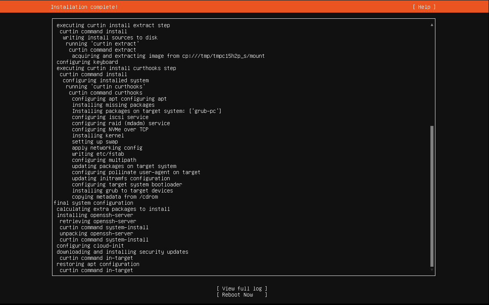

# Ubuntu Server Installation for Syslog Server

## Overview
This post documents the installation of **Ubuntu Server 22.04 LTS** in VMware Workstation Player as part of my virtual home lab.  
This server will be used to collect and store system logs (syslog) from Windows and Linux machines in the network, and to practise Linux administration.

Although this is the first VM I’m creating for the lab, it will eventually work alongside:
- **Windows Server 2019** (Active Directory, DNS, DHCP)
- **Windows 10 Client** (Domain joined workstation)

---

## Tools Used
- **VMware® Workstation 17 Pro**
- **Ubuntu Server 22.04.4 LTS ISO** (downloaded from [ubuntu.com](https://ubuntu.com/download/server))

---

## VM Configuration
| Setting         | Value                |
|-----------------|----------------------|
| CPUs            | 2 vCPUs              |
| Memory          | 4 GB                 |
| Disk Size       | 40 GB (single file)   |
| Network         | NAT (DHCP assigned)   |
| Hostname        | `ubuntusyslog`        |

---

## Installation Steps
1. **Created New VM** in VMware:
   - Selected *I will install the operating system later*
   - OS: Linux → Ubuntu 64-bit
2. **Attached Ubuntu Server ISO** to the virtual CD/DVD drive
3. **Started VM** and followed installer prompts:
   - Language: English (UK)
   - Keyboard: English (UK)
   - Network: Default adapter `ens33` (IP via DHCP `192.168.191.129/24`)
   - Skipped “Create Bond” option
4. **Proxy Configuration**: Left blank (not required for home lab NAT setup)
5. **Mirror**: Default Ubuntu archive mirror
6. **Storage Layout**: Used entire 40GB disk, default LVM
7. **User Setup**:
   - Name: `Cian`
   - Server name: `ubuntusyslog`
   - Username: `cian`
   - Password: (secure password)
8. **SSH Access**: Enabled OpenSSH server during setup
9. **Package Selection**: Left default for now (no extra snaps)

---

## What I Learned during installation
- `ens33` is the default VMware network interface name in Ubuntu
- DHCP on NAT provides immediate internet access without extra config
- Proxy settings are unnecessary unless in a corporate environment

---

## Next Steps
- Configure and install Windows Server and Client
- Change to a **static IP** in `/etc/netplan` so it works consistently with other lab machines
- Install and configure `rsyslog` to collect logs from Windows and Linux hosts
- Connect Ubuntu server to lab’s internal network once Windows Server is running

---

## Screenshots

