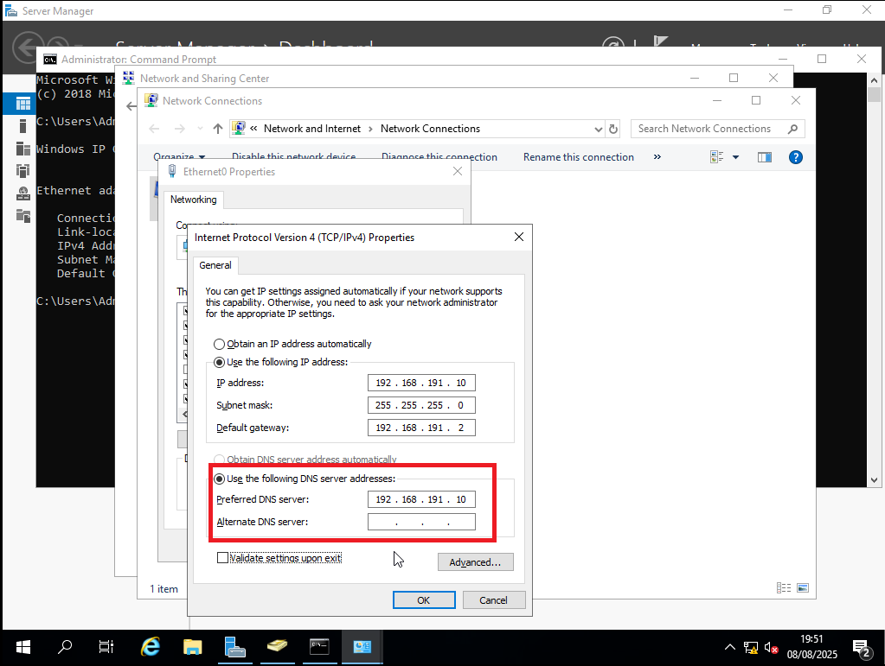

# Windows Server 2019 – Active Directory Domain Services (AD DS) Setup

## Overview
This post documents the installation and configuration of Active Directory Domain Services on a Windows Server 2019 VM.  
This server will act as the domain controller for my home lab, providing centralized authentication, DNS, and DHCP services.

---

## Tools Used
- VMware Workstation Player 17  
- Windows Server 2019 LTSC Enterprise ISO (downloaded from Microsoft)

---

## VM Configuration
| Setting         | Value                |
|-----------------|----------------------|
| CPUs            | 2 vCPUs              |
| Memory          | 4 GB                 |
| Disk Size       | 40 GB                |
| Network         | NAT (initially DHCP) |
| Hostname        | `WIN-SERVER-AD`      |

---

## Installation Steps
1. Installed Windows Server 2019 using the ISO in VMware.
2. Allowed the server to be discoverable by PC's on the same network. 
3. Set the hostname to `WIN-SERVER-AD`.  
4. Configured a **static IP address** for the server (e.g., 192.168.191.10).  
5. Installed the **Active Directory Domain Services** role via Server Manager.  
6. Promoted the server to a **Domain Controller**, creating a new forest and domain (homelab.local).  
7. Configured **DNS** during the promotion wizard.  
8. Verified AD DS, DNS, and DHCP services started successfully.
9. Troubleshooted the error with the client not recognising the DNS server. (I have added a section documenting this process with screenshots)
10. Created initial users and groups for the lab domain.  

---

## Troubleshooting error

When I tried to get the client to join the domain I encountered the following error:

My first instinct was to check the IP address using `ipconfig` on the server VM just to verify. 

After taking note, I made sure to enter the server IP address manually so that the client would point to the right DNS address. 

Following this, I proceeded to test the connection with the `ping` command. The results stated that 'homelab.local' was not recognized, but pinging the server IP address succeeded. 

Given that connection was possible between both, I went to the server VM and double checked things were in order. This includes checking the DNS Server is installed, up and running. In DNS manager, expanding the homelab.local file to check that 'win-server-ad' was displaying the correct IP address and Type Host(A).

Meanwhile, on the client side I ran `ipconfig /flushdns` to clear the cache, and tried to lookup homelab.local with `nslookup`. However, it still was failing to locate it. 

At this point I decided to open powershell on the server side to double check a few things. I used `Get-ADDomain` to retrieve information about the Active Directory domain the computer is joined to and `|` to pass the output to the next command `Select-Object DNSRoot`, which selects only the DNSRoot property from the domain information.

I also ran `Get-Service DNS` to verify the status. 

After checking yet again on the client side and failing to resolve it, I ran `ipconfig` to check what IP address was under DNS Servers. It was still showing 192.168.191.2 and hadn't updated after I manually changed it. 
[Wrong DNS address](images/TS12-WrongIPDNS.png)

Sometimes the simplest approach is the most effective solution. I simply restarted the client because sometimes Windows caches network settings stubbornly until reboot. I then ran the test again. 
(As a side note, I believe `ipconfig /release
ipconfig /renew
ipconfig /flushdns
nslookup homelab.local
` might've solved the issue without the need to reboot. Forcing Windows to renew DNS and IP. But restarting worked. 
[Successful DNS resolution](TS13-nslookup.png)

And as you can see, I was able to successfully join the client to the 'homelab.local' domain. 
[Successfully joined the domain](images/TS15-welcomeMes.png)

I then checked server-side to verify the user account has joined. 
[Verifying user joined successfully](images/TS16-UserVerify.png)

## What I Learned
- Importance of assigning a static IP to the domain controller.
- Sometimes you need to restart or force for changes to take effect even if the system doesn't prompt you to (e.g after manually setting a static IP address)
- How DNS integrates with AD for name resolution.  
- The process of creating and managing a new AD forest.  

---

## Next Steps
- Setup DHCP server role and configure scopes for client IPs.  
- Join Windows 10 clients to the domain.  
- Configure Group Policy Objects (GPOs) for lab users.

---

## Additional Screenshots

  
  

  

